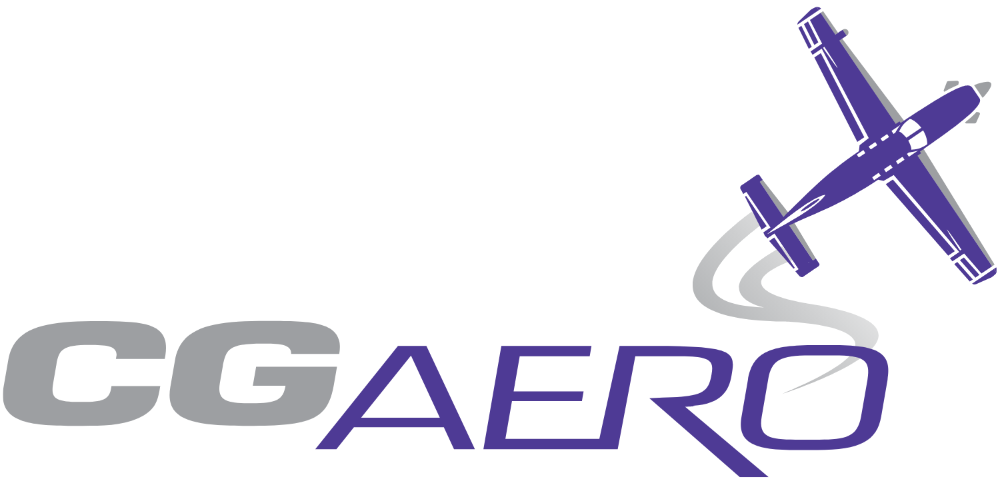

# cgaero-website

# CG Aero Corp Website

### Precision Aircraft Maintenance Since 1996

Monterey Regional Airport (KMRY)  
Aircraft Maintenance • Aviation Expertise • Craftsmanship

---

## ✈️ About CG Aero Corp

CG Aero Corp is an aircraft maintenance and repair company located at **Monterey Regional Airport (KMRY)**.

Established in **1996**, CG Aero has provided trusted aircraft maintenance services for three decades, backed by over **40 years of hands-on aviation expertise**.

This website was designed to reflect the company's values:

- Precision
- Safety
- Craftsmanship
- Aviation excellence

---

## 🛩 Services Highlighted

- Full service aircraft maintenance on piston & turbo-prop aircraft
- Annual inspections
- Phase inspections
- Pre-purchase inspections
- 100hr & 50hr inspections
- Dynamic propeller balancing
- Corrosion X & Boeshield airframe treatments
- Aircraft wheel & tire balancing
- Aircraft sales & management

---

## 🌐 Website

Official Website:

https://cgaero.com

Cloudflare Pages Deployment:

https://cgaero-website.pages.dev

---

## ⚙️ Technology

Built with:

- HTML5
- CSS3
- JavaScript
- GitHub
- Cloudflare Pages

Features:

✔ Responsive mobile-first design  
✔ SEO optimization  
✔ Fast static hosting  
✔ SSL security  
✔ Lightweight performance  
✔ Custom aviation branding  

---

## 📍 Location

CG Aero Corp  
Monterey Regional Airport (KMRY)  

1202 Airport Rd Suite T  
Monterey, CA 93940  

☎ (831) 642-0700  
✉ cgaero@aol.com

---

### Aviation Maintenance Excellence

Since 1996 ✈️

© 2026 CG Aero Corp

